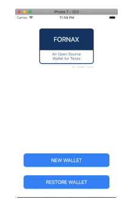

> In ancient Roman religion, Fornax was the divine personification of the oven.

&nbsp;&nbsp;&nbsp;&nbsp;&nbsp;&nbsp;&nbsp;&nbsp;&nbsp;&nbsp;&nbsp;&nbsp;&nbsp;&nbsp;&nbsp;&nbsp;&nbsp;&nbsp;&nbsp;&nbsp;&nbsp;&nbsp;&nbsp;&nbsp;&nbsp;&nbsp;&nbsp;&nbsp;&nbsp;&nbsp;&nbsp;&nbsp;&nbsp;&nbsp;&nbsp;&nbsp;&nbsp;&nbsp;&nbsp;&nbsp;&nbsp;&nbsp;&nbsp;&nbsp;&nbsp;&nbsp;&nbsp;&nbsp;&nbsp;&nbsp;&nbsp;&nbsp;&nbsp;&nbsp;&nbsp;&nbsp;&nbsp;&nbsp;&nbsp;&nbsp;&nbsp;&nbsp;&nbsp;&nbsp;&nbsp;&nbsp;&nbsp;&nbsp;&nbsp;&nbsp;&nbsp;&nbsp;&nbsp;&nbsp;&nbsp;&nbsp;&nbsp;&nbsp;&nbsp;&nbsp;&nbsp;&nbsp;&nbsp;&nbsp;&nbsp;&nbsp;&nbsp;&nbsp;&nbsp;&nbsp;&nbsp;&nbsp;&nbsp;&nbsp;&nbsp;&nbsp;&nbsp;&nbsp;&nbsp;&nbsp;Source: [Wikipedia](https://en.wikipedia.org/wiki/Fornax_(mythology))

---

# Fornax &nbsp;&nbsp;&nbsp; [](https://travis-ci.org/keefertaylor/Fornax)
Fornax is a Tezos Wallet for iOS based on [TezosKit](https://github.com/keefertaylor/TezosKit).



Supported Functionality:
* Wallet Creation / Restoration
* Sending Tezos

Features to Be Implemented:
* Delegation
* Origination
 
# Installation
Fornax is developed with CocoaPods. To build the project:

```shell
$ git clone
$ pod install
$ open Fornax.xcworkspace
```

# Contributions
Please send pull requests and I will happily merge them after review.

# License
MIT
